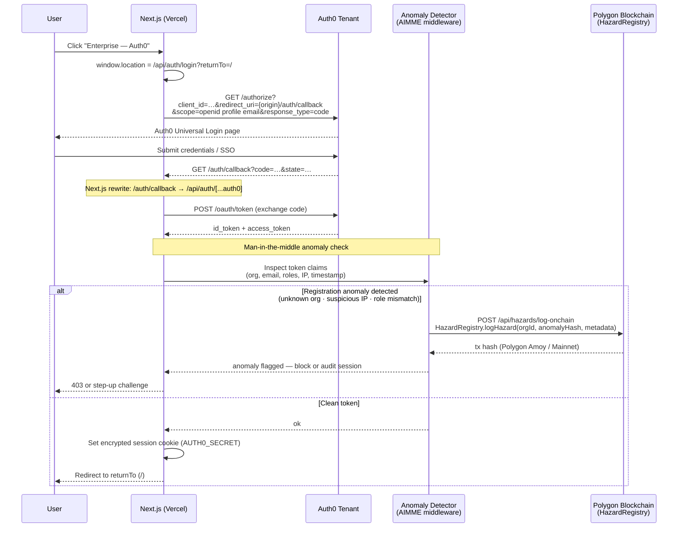

# AIMME Web

Next.js dashboard for AIMME signals with a same-origin API proxy.

## Environment

- `AIMME_API_BASE_URL` (recommended for Vercel/server): AWS API Gateway base URL, no trailing slash
- `NEXT_PUBLIC_API_URL` (local dev): local API URL, typically `http://localhost:8000`
- `MARKET_DATA_API_KEY` (server-only): Massive(Previously Massive.io) API key for candlestick market data route
- `POLYGON_RPC_URL` (server-only): Polygon Amoy RPC endpoint (Alchemy recommended)
- `POLYGON_PRIVATE_KEY` (server-only): signer wallet private key for hazard logging
- `HAZARD_REGISTRY_ADDRESS` (server-only): deployed `HazardRegistry` contract address
- `POLYGON_CHAIN_ID` (server-only): `80002` for Amoy or `137` for Polygon mainnet
- `POLYGONSCAN_API_KEY` (optional server-only): explorer status lookups

Example:

```bash
AIMME_API_BASE_URL=https://xxxx.execute-api.us-east-1.amazonaws.com/prod
NEXT_PUBLIC_API_URL=http://localhost:8000
MARKET_DATA_API_KEY=your_massive_api_key
POLYGON_RPC_URL=https://polygon-amoy.g.alchemy.com/v2/YOUR_ALCHEMY_KEY
POLYGON_PRIVATE_KEY=0x...
HAZARD_REGISTRY_ADDRESS=0x...
POLYGON_CHAIN_ID=80002
POLYGONSCAN_API_KEY=...
```

## Dev

```bash
npm install
npm run dev
```

The browser calls `/api/*`; Next.js API routes forward to AWS.

## Auth0 (Enterprise Login)

Enterprise login uses Auth0 via `@auth0/nextjs-auth0`. The handler is lazy-loaded to avoid a
module-init crash (`next/headers` requires a live request context in the Pages Router).



### Key env vars

| Variable | Purpose |
|---|---|
| `AUTH0_SECRET` | 32+ char secret for session cookie encryption |
| `AUTH0_ISSUER_BASE_URL` | `https://<tenant>.auth0.com` |
| `AUTH0_BASE_URL` | App origin (used by SDK for fallback redirects) |
| `AUTH0_CLIENT_ID` / `AUTH0_CLIENT_SECRET` | Auth0 application credentials |
| `AUTH0_CALLBACK` | Callback path registered in Auth0 dashboard — set to `/auth/callback` in Vercel env |

Auth0 dashboard **Allowed Callback URLs** must include `{origin}/auth/callback`
(e.g. `https://web-one-rho-28.vercel.app/auth/callback`).

## Proxy routes

- `GET/POST /api/signals` → `/signals`
- `GET /api/alerts` → `/alerts`
- `POST /api/process` → `/process`
- `POST /api/alert` → `/alert`
- `GET /api/market/candles` → Massive(Previously Massive.io) aggregates API for real-time OHLC candles
- `POST /api/hazards/log-onchain` → submit hazard event to `HazardRegistry` on Polygon
- `GET /api/hazards/tx-status?key=...` → fetch hazard tx status (Polygonscan API when configured)
